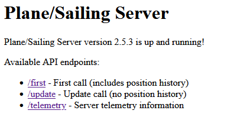
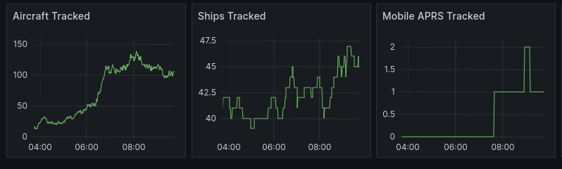

# Plane Sailing Server

*The home situational awareness display nobody wanted or needed!*


This is the server-side code for Plane/Sailing version 2.

This software receives data from local ADS-B, AIS and APRS receiving software for tracking planes, ships and amateur radio stations respectively. It combines them into one large "track table", and provides a web interface by which the [Plane/Sailing client](https://github.com/ianrenton/planesailing) can fetch data via JSON.

For more information on the Plane/Sailing project, please see https://ianrenton.com/hardware/planesailing

## Features

* Receives AIS messages in NMEA-0183 format via UDP (e.g. from rtl_ais)
* Receives Mode-S/A/C, ADS-B and some Comm-B messages in BEAST Binary, BEAST AVR and SBS/BaseStation format (e.g. from Dump1090)
* Receives MLAT messages in BEAST Binary and SBS/BaseStation format (e.g. from PiAware)
* Receives complete aircraft data sets direct from Dump1090 in its own JSON format, if preferred
* Receives APRS messages via KISS TCP (e.g. from Direwolf)
* Includes support for config-based addition of extra tracks for the base station, airports and seaports
* Includes support for config-based addition of AIS track names, to cover the period between getting a position message and a details message
* Includes look-up tables to determine aircraft operators, types, and the correct MIL-STD2525C symbols to use for a variety of tracks
* Persists data to disk so the content of the track table is not lost on restart
* Customisable times to drop tracks etc.
* Provides a web-based JSON API which can be used to retrieve this information.

## Getting a Copy

If you just want to use Plane/Sailing Server (without making any changes to the source code), go to the [latest release](https://github.com/ianrenton/planesailing-server/releases/latest) page and download the ZIP file containing the compiled software. This will be a ZIP named like "`plane-sailing-server-x.y.z.zip`" (*not* "Source Code (zip)").

Unpack this to wherever you would like to run it from, then jump ahead to the Setup section.

### Building from Scratch

If you want to modify and build the software yourself, it's best to clone it using git, e.g. `git clone git@github.com:ianrenton/planesailing-server.git`. If you're a GitHub user you could also create your own fork before doing this.

Plane/Sailing Server is a Maven project, so with Maven and a JDK installed, you can build it by running `mvn package`, and you'll find the output in `target/output/`.

However there is one complication, in that this project depends on [javAPRSlib](https://github.com/ab0oo/javAPRSlib) which is a Maven project, but isn't published anywhere. So before you try to build Plane/Sailing Server, you'll need to clone that project, check out the 2.0-release tag, and install it locally with `mvn install`. You should _then_ be able to build this project without issues.

## Setup

In order to use this software, you should be running some combination of software to provide the data to it, e.g. AIS-Catcher or rtl_ais, Dump1090/PiAware, Direwolf etc. You can find more information on how to install and set those up on the [Plane/Sailing build guide](https://ianrenton.com/hardware/planesailing). 

To run Plane/Sailing Server:

1. Ensure your machine has Java 17 or later installed, e.g. `sudo apt install openjdk-17-jre-headless`
2. Find your copy of Plane/Sailing Server, either from the ZIP download or one you built yourself (see the previous section). You should have three files: a JAR file, an `application.conf` file, a `run.sh`, and a `data` subdirectory.
3. Edit `application.conf` and set the IP addresses and ports as required. Each section (AIS, ADS-B, MLAT, APRS) contains a *list* (within square brackets) of connections (blocks surrounded by curly brackets) to make. If you don't have a particular data type, e.g. you don't do APRS, remove the entry for that section leaving an empty list like `aprs-receivers: []`. If you have more than one connection to make in a category, add multiple blocks.
4. Set the base station position, and any airports and seaports you'd like to appear in your data.
5. Save `application.conf` and run the application, e.g. `chmod +x run.sh`, `./run.sh`
6. Hopefully you should see log messages indicating that it has started up and loaded data! Every 10 seconds it will print out a summary of what's in its track table.

### A Note on Choosing Aircraft Data Protocols

A number of aircraft data formats are supported&mdash;for the gory details see the [Tracking Packet Format FAQ](https://ianrenton.com/hardware/planesailing/tracking-packet-format-faq/#what-are-the-common-formats-of-mode-s-data). The preferred format is BEAST Binary format, which Dump1090 produces as an output. This contains the raw Mode-A, Mode-C, Mode-S, ADS-B and Comm-B bytes with some encapsulation. Plane/Sailing can use the same format for receiving live data from the radio via Dump1090 as it can receiving MLAT data from PiAware.

BEAST AVR format is also supported, which is ASCII-encoded and therefore a little easier to parse, but PiAware does not support this for MLAT data. SBS/BaseStation format is supported too, which is both ASCII-encoded *and* supported by PiAware for MLAT, but it doesn't contain all information fields e.g. aircraft category.

Finally, Plane/Sailing v1 loaded its aircraft data from a JSON file written by Dump1090, and Plane/Sailing v2 preserves this capability. This data contains every data point including merged-in MLAT data, however the data is not "live" so requires some adjustments in the code for the time at which data was recorded. It's no longer the preferred option but it is available.

If you're not sure, the default will work fine.

## Checking the Web Interface

By default, Plane/Sailing Server runs on port 8090. Leave the software running, then access `http://[ipaddress]:8090/` in a web browser. You should see something that looks like this:



*(Expecting to see the Plane/Sailing interface, with a map background etc.? That's part of the [Plane/Sailing client](https://github.com/ianrenton/planesailing), not the server. The two are provided separately in case you want to run them in different places&mdash;e.g. I run the server on a Raspberry Pi, but host the client using GitHub Pages. If you want to run the client and server on the same machine, read on as this is covered in the "Reverse Proxy Setup" section.)*

### Automatic Run on Startup

Depending on your use case you may wish to have the software run automatically on startup. How to do this is system-dependent, on most Linux systems that use systemd, like Ubuntu and Raspbian, you will want to create a file like `/etc/systemd/system/plane-sailing-server.service` with the contents similar to this:

```
[Unit]
Description=Plane/Sailing Server
After=network.target

[Service]
ExecStart=/home/pi/plane-sailing-server/run.sh
WorkingDirectory=/home/pi/plane-sailing-server
StandardOutput=inherit
StandardError=inherit
Restart=always
User=pi

[Install]
WantedBy=multi-user.target
```

Then to complete the setup by running:

```bash
sudo systemctl daemon-reload
sudo systemctl enable plane-sailing-server
sudo systemctl start plane-sailing-server
```

If you want to check it's working, use e.g. `systemctl status plane-sailing-server` to check it's alive, and `journalctl -u plane-sailing-server.service -f` to see its logs in real time. You should see it successfully start up its interfaces to Dump1090, AIS Dispatcher and Direwolf (assuming they are all enabled) and the regular track table messages should indicate several ships, aircraft and APRS tracks depending on what's around you.

If you are running Plane/Sailing Server on Windows you can make it start automatically by using NSSM to install Plane/Sailing Server as a service, or with Scheduled Tasks, a shortcut in your Startup items, etc.

### Reverse Proxy Setup

The client can quite happily connect to the Plane/Sailing Server directly on its default port of 8090. However, you may wish to add a "proper" web server providing a reverse proxy setup. There are several reasons you might want to do this:

* It allows the use HTTPS (with certificates, e.g. from Let's Encrypt), so the client can connect securely
* It allows Plane/Sailing Server to run on a port that Linux will let it open with normal user privileges (by default 8090) while still making it accessible to the internet on port 80 and/or 443
* You can host other software on the same machine, e.g. Plane/Sailing Client, Dump1090, AIS Dispatcher etc. via the same public port.
* You can [enable caching in the web server](https://docs.nginx.com/nginx/admin-guide/content-cache/content-caching/), so that no matter how many visitors your site gets, the server itself sees a stable number of requests and doesn't get overloaded.

In this example, we will use Nginx due to its relatively easy config and support in Let's Encrypt Certbot, but you could use Apache, Lighttpd, HAProxy or anything you like that supports a reverse proxy configuration.

Start off by installing Nginx, e.g. `sudo apt install nginx`. You should then be able to enter the IP address of the server using a web browser and see the "Welcome to nginx" page. Next we need to change that default setup to instead provide a reverse proxy pointing at Plane/Sailing Server. Create a file like `/etc/nginx/sites-available/plane-sailing-server.conf` with contents similar to the following:

```
server {
    listen 80;
    server_name planesailingserver.ianrenton.com;

    location / {
        proxy_pass http://127.0.0.1:8090;
    }
}
```

This sets up your server for HTTP only at the moment, which is OK - we will let Certbot set up the HTTPS configuration later.

Once you're finished creating that file, delete the default site, enable the new one, and restart nginx:

```bash
sudo rm /etc/nginx/sites-enabled/default
sudo ln -s /etc/nginx/sites-available/plane-sailing-server.conf /etc/nginx/sites-enabled/plane-sailing-server.conf
sudo systemctl restart nginx
```

When you now visit the IP address of your server using a web browser, you should instead see "Plane/Sailing Server is up and running!". Your reverse proxy setup is now working, and a client pointed at the default HTTP port (80) on that PC will now be able to communicate with Plane/Sailing Server.

If nginx didn't restart properly, you may have mistyped your configuration. Try `sudo nginx -t` to find out what the problem is.

You may wish to add extra features to this configuration. For example if you wanted Plane/Sailing Server accessible in the root directory as normal, but then have Dump1090 on `/dump1090-fa` and AIS Dispatcher's web interface on `/aisdispatcher` too, all on port 80, you can do that by tweaking the adding new "location" parameters as follows. They are handled in order so Plane/Sailing Server comes *last*, only if the URL doesn't match any of the other locations.

```
server {   
    listen 80;
    server_name planesailingserver.ianrenton.com;

    # Skyaware web interface
    rewrite ^/skyaware$ /skyaware/ permanent;
    location /skyaware/ {
        alias /usr/share/skyaware/html/;
        # Allow CORS requests to /data/ for UMID1090 - not necessarily required for your server!
        add_header Access-Control-Allow-Origin *;
    }
    location /skyaware/data/ {
        alias /run/dump1090-fa/;
        # Allow CORS requests to /data/ for UMID1090 - not necessarily required for your server!
        add_header Access-Control-Allow-Origin *;
    }

    # AIS Dispatcher web interface
    rewrite ^/aisdispatcher$ /aisdispatcher/ permanent;
    location /aisdispatcher/ {
        proxy_pass http://127.0.0.1:8080;
    }

    # Plane/Sailing Server
    location / {
        proxy_pass http://127.0.0.1:8090;
    }
}

```

If you want to host both the Plane/Sailing client ([available separately](https://github.com/ianrenton/planesailing)) and the server on the same machine, you can use the same reverse proxy approach. Here it would make sense to have the client in the root of the server, and the server in a subdirectory. For example you could put the client in `/home/pi/plane-sailing-client` and set up your nginx config file like this:

```
server {   
    listen 80;
    server_name planesailing.yourdomain.com;

    # Plane/Sailing Server
    location /server/ {
        proxy_pass http://127.0.0.1:8090;
    }

    # Plane/Sailing Client
    location / {
        alias /home/pi/plane-sailing-client;
    }
}
```

### HTTPS Setup

You can use Let's Encrypt to enable HTTPS on your Nginx server, so the client can request data securely. The easiest way is using Certbot, so following the [instructions here](https://certbot.eff.org/lets-encrypt/debianbuster-nginx):

```bash
sudo apt install snapd
sudo snap install core
sudo snap refresh core
sudo snap install --classic certbot
sudo ln -s /snap/bin/certbot /usr/bin/certbot
sudo certbot --nginx
```

At this stage you will be prompted to enter your contact details and domain information, but Certbot will take it from there&mdash;it will automatically validate the server as being reachable from the (sub)domain you specified, issue a certificate, install it, and reconfigure nginx to use it.

If it fails with an error involving `/.well-known/acme-challenge`, it's trying to verify that your server can be retrieved at the URL you have set up, but it can't create a file and and check that it exists because your nginx config is pointing to Plane/Sailing Server via the remote proxy setup rather than a standard directory of HTML files. If this is the case, you will want to add the following to your nginx config:

```
    # Wellknown area for Lets Encrypt
    location /.well-known/ {
        alias /var/www/html/.well-known/;
    }
```

Once Certbot finishes its job, what you'll probably find is that it has helpfully reconfigured your server to use *only* HTTPS, and HTTP now returns a 404 error. In my opinion it would be best for both versions to provide the same response. To re-enable both HTTP and HTTPS, you need to delete the extra "server" block in `/etc/nginx/sites-enabled/plane-sailing-server.conf` and add `listen 80` back into the main block. You should end up with something like this (with your own domain names in there):

```
server {
    listen 80;
    listen 443 ssl;
    server_name planesailingserver.ianrenton.com;

    location / {
        proxy_pass http://127.0.0.1:8090;
    }

    ssl_certificate /etc/letsencrypt/live/planesailingserver.ianrenton.com/full$
    ssl_certificate_key /etc/letsencrypt/live/planesailingserver.ianrenton.com/$
}

```

Finally, `sudo systemctl restart nginx` and you should now find that Plane/Sailing Server is accessible via both HTTP and HTTPS. The good news is, Certbot should automatically renew your certificate when required, and shouldn't mess with your config again.

Job. Done.

## Client Usage

The Plane/Sailing client, or any other client you write, should do the following:

1. At the start of a user session, make a call to `/first`. The response will be a JSON map of ID to track parameters. All tracks will be included, and if they have a position history, that will be included too. This information should be stored locally, and used to render the tactical picture.
2. Every few seconds (suggested: 10), make a call to `/update`. The response will be the same JSON map, which should be merged with the original one. There are a few complications to this merge:
    * The new data won't include position history, to save bandwidth. Rather than overwriting the client's track with the new one, it should preserve the old position history, appending the new position in the track data to the position history list.
    * Any track the client has that *isn't* in the update data set should be dropped, *except* if it has the `createdByConfig` flag set true. These are the immutable tracks that represent the base station, airports and seaports, and they are only sent in the `/first` call, again to save bandwidth. Their absence in the `/update` call doesn't mean they should be deleted.
3. Rather than just reporting tracks' last known locations, clients may wish to "dead reckon" their current position and update the display with that more often than every 10 seconds. Because the server and client's clocks may not match, the server provides a "time" field (milliseconds since UNIX epoch) in every response. The position data for each track has a time field too. The combination of these can be used to determine how old the track's data is without having to use the local system clock.
4. Optionally, clients can make a call to `/telemetry` for server telemetry such as connection status, CPU utilisation, uptime etc.

Clients are of course free to set their own policies about what tracks to show and hide, how to present the data, etc. If you are writing your own client or fork of Plane/Sailing, I am happy to receive pull requests to add new data into the API.

If you're just looking for the default web-based client that I wrote, [that's here](https://github.com/ianrenton/planesailing) and it's also Public Domain, so you can just use it or modify it however you like.

## Prometheus Metrics

Plane/Sailing Server exposes a Prometheus metrics endpoint from its web server, at the standard URL of `/metrics`. Metrics available include the number of tracks of various types in the system, and maximum detection ranges. This can be used to aggregate & analyse data on performance, provide alerting on the loss of a feed, and to add pretty graphs to Grafana.

